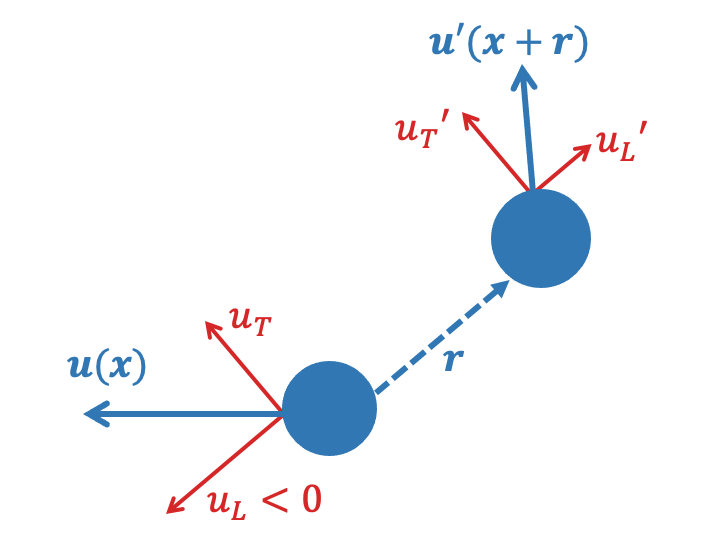
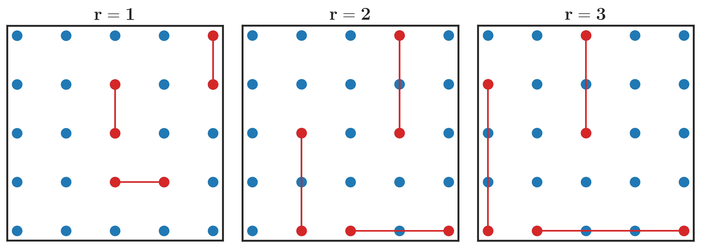

What are structure functions?
=============================

.. _Overview:

The structure functions (SFs) calculated within this package are statistics that describe how fluid properties vary between pairs of points as a function of their separation vector (:math:`\mathbf{r}`), averaged over all pairs of points with the same separation vector. There are numerous structure functions, describing different-order correlations of various variables, that can provide fundamental insights into the physical properties of dynamic fluid systems.

.. _Theory:

Structure functions and how to calculate them
---------------------------------------------------

**Scalar Structure Functions**

When a scalar property, arbitrarily :math:`\phi`, is measured at various locations, we can calculate second-order structure functions that describe the scalar's spatial variations: 

.. math:: 
    SF_{\phi\phi}(\mathbf{r}) = \overline{{\left[\phi(\mathbf{x}+\mathbf{r}) - \phi(\mathbf{x})\right]^2}} = \overline{{\left[\delta \phi \right]^2}}

where :math:`\theta(\mathbf{x})` is the scalar at position :math:`\mathbf{x}`, and  :math:`\mathbf{r}` is the separation vector between pairs of points. The overline represents an average over all pairs of data in the flow field that are separated by :math:`\mathbf{r}`, and :math:`\delta \phi` is a short-hand notation for the spatial difference in the scalar. This second-order (i.e. product of two :math:`\delta`) structure function can be used to characterize the distribution of scalar variance across different scales of motion (McCaffrey et al., 2015), analogous to the power spectra of the scalar field. Common scalars for fluid systems include temperature, density, and (vertical) vorticity.

**Velocity Structure Functions**

Since velocity is a vector, structure functions often decompose a (two dimensional) velocity field into a longitudinal component (:math:`u_L = \mathbf{u} \cdot \mathbf{\hat{r}}`) and a transverse component (:math:`u_T = \mathbf{u} \times \mathbf{\hat{r}}`). These velocity components can be visualized by considering a pair of velocity observations separated by a vector :math:`\mathbf{r}`, as illustrated below. 

There are a variety of physically-useful velocity structure functions including second-order structure functions of both velocity components,

.. math:: 
    SF_{LL}(\mathbf{r}) = \overline{{\left[u_L(\mathbf{x}+\mathbf{r}) - u_L(\mathbf{x})\right]^2}} = \overline{{\left[\delta u_L \right]^2}}

.. math::
    SF_{TT}(\mathbf{r}) = \overline{{\left[\delta u_T \right]^2}}

The spatial variations of :math:`SF_{LL}` and :math:`SF_{TT}`, and their ratio, are often used to explore the distribution of energy across scales (LaCasce, 2016), and the relative prevalence of rotational and divergent motions within a fluid (Lindborg, 2015).

It is also common to utilize third-order velocity structure functions,

.. math:: 
    SF_{LLL}(\mathbf{r}) = \overline{{\left[\delta u_L \right]^3}}

.. math::
    SF_{LTT}(\mathbf{r}) = \overline{{\left[\delta u_L \right]\left[\delta u_T \right]^2}}

.. math::
    SF_{L\phi \phi}(\mathbf{r}) = \overline{{\left[\delta u_L \right]\left[\delta \phi \right]^2}}

which can provide information about the inter-scale transfers of energy (:math:`SF_{LTT}` and :math:`SF_{LTT}`) or tracer variance (:math:`SF_{L\phi\phi}`) within a fluid flow. Note that :math:`SF_{LTT}` and :math:`SF_{L\phi\phi}` are blended structure functions, in that they utilize the spatial differences of multiple properties. 

Now consider an array of moorings. The structure function is calculated for all pairs of moorings separated by :math:`r`, and the average is taken over all pairs. The diagram below depicts an array of moorings and highlights mooring pairs with separation vectors of :math:`r = 1`, :math:`r = 2`, and :math:`r = 3`.

.. _Advective structure functions:

Advective structure functions
-----------------------------

Advective structure functions (herein ASFs) are a novel type of blended structure function (Pearson et al., 2021). The advective structure functions for velocity and scalars are,

.. math:: 

    ASF_{velocity}(\mathbf{r}) = \overline{\delta \mathbf{u} \cdot \delta \boldsymbol{\mathcal{A}}_{\mathbf{u}}}

.. math::
    ASF_{\phi}(\mathbf{r}) = \overline{\delta \phi \delta \mathcal{A}_{\phi}}

As the name suggests, advective structure functions depend on the advection of scalars (:math:`\mathcal{A}_{\phi}(\mathbf{x}) = \left[\mathbf{u} \cdot \nabla\right] \phi`) or velocity (:math:`\boldsymbol{\mathcal{A}}_{\mathbf{u}}(\mathbf{x}) = \left[\mathbf{u} \cdot \nabla\right] \mathbf{u}`) where :math:`\nabla` is the gradient operator.

Similar to the third-order structure functions above, advective structure functions can provide information about inter-scale transfers of energy, enstrophy, and tracer variance in simple/idealized flows. An advantage of advective structure functions is that can also be used to diagnose these properties to more complex flows (e.g., with strong anisotropy), and have different statisical properties (Pearson et al., 2021).  

.. _Derived relationships between various structure functions and turbulent properties:

Example relations between various structure functions and turbulent properties
----------------------------------------------------------------------------------

As mentioned earlier, structure functions have been used to estimate to infer physical properties of turbulent properties. For example, in 2D turbulence, the following table shows several SF relationships that can be used to diagnose the inverse (upscale) cascade rate of energy (after some assumptions about flow properties):

.. list-table:: 
   :header-rows: 1
   
   * - Structure function
     - Relation to 2D upscale energy transfer (:math:`\epsilon>0`)
     - Reference
   * - :math:`SF_{LLL}`
     - :math:`\frac{3}{2}\epsilon r`
     - `Lindborg (1999) <https://doi.org/10.1017/S0022112099004851>`_
   * - :math:`SF_{L\mathbf{u}\mathbf{u}}=SF_{LLL}+SF_{LTT}`
     - :math:`2\epsilon r`
     - `Lindborg (1999) <https://doi.org/10.1017/S0022112099004851>`_
   * - :math:`ASF_{velocity}`
     - :math:`2\epsilon`
     - `Pearson et al. (2021) <https://doi.org/10.1017/jfm.2021.247>`_

.. _References:

References
----------

- Lindborg, E., 1999: `Can the atmospheric kinetic energy spectrum be explained by two-dimensional turbulence? <https://doi.org/10.1017/S0022112099004851>`_ *Journal of Fluid Mechanics.*
- Lindborg, E., 2015: `A Helmholtz decomposition of structure functions and spectra calculated from aircraft data. <https://doi.org/10.1017/jfm.2014.685>`_ *Journal of Fluid Mechanics.*
- LaCasce, J. H., 2016: `Estimating Eulerian energy spectra from drifters. <https://doi.org/10.3390/fluids1040033>`_ *Fluids*
- McCaffrey, K., B. Fox-Kemper, \& G. Forget, 2015: `Estimates of ocean macroturbulence: Structure function and spectral slope from Argo profiling floats. <https://doi.org/10.1175/JPO-D-14-0023.1>`_ *Journal of Physical Oceanography*
- Pearson, B., J. Pearson, \& B. Fox-Kemper, 2021: `Advective structure functions in anisotropic two-dimensional turbulence. <https://doi.org/10.1017/jfm.2021.247>`_ *Journal of Fluid Mechanics.*
